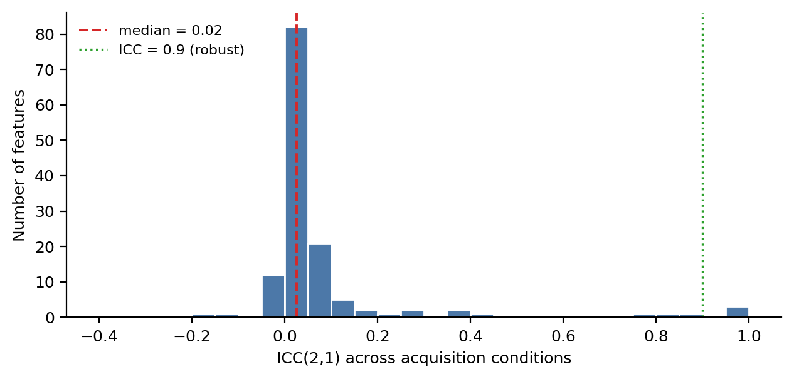

**Author affiliation.** Shuji Yamamoto, PhD — Institute of One (supported by Lisit Co., Ltd., Japan; TexelCraft OÜ, Estonia).

**Corresponding author.** Shuji Yamamoto — yamamoto@lisit.jp · ORCID [0000-0001-9211-1071](https://orcid.org/0000-0001-9211-1071).

**Software.** `radiomics-phantom` v0.6.0 (MIT). Code: <https://github.com/Institute-of-One/radiomics-phantom>. Archive DOI: [10.5281/zenodo.21309875](https://doi.org/10.5281/zenodo.21309875) (all versions).

---

## 1. Background and Motivation

Radiomics extracts large numbers of quantitative features from medical images to characterise tissue phenotype [1]. A persistent obstacle to clinical translation is that many features are highly sensitive to how the image was acquired and reconstructed — dose, reconstruction kernel, slice thickness, and voxel size — so that measured values reflect the scanner as much as the biology. The Image Biomarker Standardization Initiative (IBSI) has standardised feature definitions and provides a digital reference phantom with benchmark values [2], and widely used toolkits implement these definitions [3]. Standardised *definitions*, however, do not by themselves make feature *values* reproducible across acquisitions.

Studying that reproducibility normally requires repeated patient scans, which are scarce and cannot be shared, or post-hoc harmonisation against a reference cohort (for example ComBat [6]), which treats acquisition effects as nuisance to be regressed out rather than as known physics. We take a different route: a fully synthetic testbed in which the texture is known by construction and the acquisition is a controlled, physically motivated transformation. Because nothing derives from a human subject, the entire study is shareable and exactly reproducible.

**Contribution.** We provide (a) an open, deterministic generator of 3D texture phantoms with ground truth, paired with a from-scratch IBSI-compliant feature core validated to the full set of published reference values; (b) a *stability atlas* that rates every feature's reproducibility across a texture-by-acquisition sweep using ICC and the concordance correlation coefficient; and (c) a physics-based normalisation that corrects a feature using its known response to a measurable acquisition descriptor, and that refuses to correct features whose response it cannot model.

## 2. Methods

### 2.1 Synthetic texture phantom

The background parenchyma is a stationary Gaussian random field: white noise convolved with an anisotropic Gaussian kernel in the Fourier domain. A kernel of standard deviation *s* produces an autocovariance exp(-r^2 / 4s^2), so the lag at which correlation falls to 1/e is exactly 2*s*; that lag, in millimetres, is the prescribed correlation length, controllable per axis to yield anisotropic texture. An optional ellipsoidal lesion is filled with a second, independent field of different mean, contrast, and correlation length. Every generator takes a seed and returns a bit-identical volume together with its ground truth. An empirical estimator recovers the correlation length from the power spectrum, confirming the field carries the requested texture.

### 2.2 IBSI-compliant feature core

All eleven IBSI families are implemented from their definitions using only array primitives: intensity statistics and histogram, the intensity-volume histogram, morphology and local intensity, and the six texture families (grey-level co-occurrence, run length, size zone, distance zone, neighbourhood grey-tone difference, and neighbouring grey-level dependence), each over their IBSI aggregations. Discretisation defaults to fixed bin size, the IBSI recommendation for calibrated intensity scales. Degenerate regions raise explicit errors rather than returning undefined values.

### 2.3 Acquisition simulator

The same texture is observed under many simulated scanners by applying deterministic, physically motivated degradations: an anisotropic Gaussian point spread function (reconstruction-kernel blur, specified by full width at half maximum), through-plane slice-profile averaging, additive Gaussian noise optionally correlated like a reconstruction kernel and scaled with dose as 1/sqrt(dose), interpolation onto a different voxel grid, and intensity quantisation. Effects are applied in acquisition order (blur, resample, noise, quantise). Only noise is stochastic and is seeded; a given phantom, settings, and seed give a bit-identical acquisition.

### 2.4 Stability atlas

A set of phantom textures (the *targets*) is observed under a set of acquisition settings (the *conditions*). For each feature, reproducibility is summarised by the two-way random-effects, single-measurement, absolute-agreement intraclass correlation ICC(2,1) [4] across the target-by-condition table, and by Lin's concordance correlation coefficient [5] of each degraded condition against the reference. Both statistics are implemented from first principles and validated against an independent library (pingouin) in the test suite.

### 2.5 Physics-based normalisation

Rather than harmonise against a cohort, a feature's response to one acquisition descriptor is calibrated on the phantom by sweeping that descriptor and fitting a simple invertible model (linear or power); the model is then inverted to map an observed feature back to a reference acquisition. A feature whose calibration the model cannot describe (coefficient of determination below 0.9) is refused rather than silently corrected.

## 3. Implementation and Scope

The software is pure Python (numpy, scipy, scikit-image; matplotlib and an optional tkinter GUI), deterministic, and covered by 716 automated tests with continuous integration on Python 3.10–3.12. It is released under the MIT licence (text and figures under CC BY 4.0) and archived on Zenodo. An interactive desktop tool (Phantom Studio) exposes the phantom, acquisition, and feature stages for exploration. This preprint reports the open core and its reproducible synthetic benchmarks; no clinical or real-data validation is claimed.

## 4. Validation and Results

### 4.1 IBSI validation

Computed on the IBSI digital phantom, the feature core reproduces all **482** published reference values exactly, to the three significant digits at which they are published, across every implemented family and aggregation. The four bounding-shape density features that IBSI leaves unstandardised are the only IBSI-1 features not implemented. Test fixtures are regenerated directly from the authoritative IBSI sources rather than transcribed, and the exact-match assertions run in continuous integration.

### 4.2 Acquisition sensitivity

The degradations move features in the direction physics predicts. For a representative grey-level co-occurrence contrast feature on a fixed texture, adding noise of increasing standard deviation raised contrast monotonically (from 0.26 with no noise to 0.60, 2.28, and 8.27 at noise levels of 10, 25, and 50 HU-like units), while increasing reconstruction-kernel blur lowered it (from 0.26 to 0.24, 0.21, and 0.16 at full widths at half maximum of 2, 4, and 6 mm). Independent noise adds in quadrature to the intensity variance, as expected.

### 4.3 Stability atlas

Sweeping five phantom textures across five acquisition conditions (a noiseless reference, two noise levels, a blur, and a combined noise-plus-blur setting) and rating 136 features, reproducibility spanned the whole range of ICC (median 0.02; minimum -0.20; maximum 1.00), with three features reaching ICC above 0.9 under these deliberately harsh conditions (Figure 2). The least reproducible features were dispersion-type histogram descriptors (for example the interquartile range and quartile coefficient of dispersion, ICC below 0); the most reproducible included minimum intensity and dependence-count percentage (ICC 1.00), cluster shade (0.99), and median intensity (0.86). The atlas thus ranks features from fragile to robust for a given acquisition envelope, which can guide feature selection before any downstream model is built.

### 4.4 Physics-based normalisation

Intensity variance followed var0 + b*sigma^2 under added noise, with a fitted slope b = 1.00 and intercept equal to the noiseless variance (625 HU-like units squared), at R-squared = 1.000 (Figure 3, left). Inverting this calibration collapsed the raw measurements — which spanned 625 to 1526 as noise increased — back onto the noiseless value, leaving a residual spread below 0.3 (Figure 3, right). A feature whose response the model could not describe was correctly refused, rather than returned as a spurious correction.

## 5. Reproducibility

Every result in this preprint is deterministic and re-runs to bit-stable values from a fixed seed and the released code. The IBSI test fixtures are regenerated from their authoritative sources by a script (`scripts/fetch_ibsi_reference.py`); the figures and every quoted number are produced by `paper/make_figures.py` and written to `paper/figures/results.json` so that text and figures cannot diverge. The full suite (716 tests, including the 482 exact IBSI assertions) runs offline in continuous integration across Python 3.10–3.12.

## 6. AI-Use Disclosure

This manuscript and the associated software were produced by a human author (S. Yamamoto), who is solely accountable for their content. AI agents were used as tools: code scaffolding and refactoring of the modules, test drafting, figure and script generation, and manuscript drafting were assisted by a large language model (Claude, Anthropic). The author independently re-executed every numerical result reported here (the IBSI validation, the acquisition sweep, the stability atlas, the normalisation, and the test suite) and verified all figures, equations, and claims against the code. No AI system is an author. This disclosure follows ICMJE and COPE guidance: AI is reported as a tool, not credited with authorship.

## 7. Limitations

Synthetic Gaussian-random-field texture is a controlled idealisation, not a substitute for the full complexity of real tissue; the acquisition model captures dominant effects (blur, noise, slice profile, voxel size, quantisation) but not every scanner-specific behaviour; and the normalisation demonstrated here is exact for intensity variance under additive noise, whereas many features will require richer response models or prove irreducible — which the framework flags explicitly rather than correcting blindly. The stability atlas is reported for one illustrative acquisition envelope; conclusions about a specific feature's robustness are conditional on the swept conditions. No clinical, regulatory, or real-data validation is claimed. External calibration of the phantom's noise and resolution to a specific scanner, additional acquisition effects, per-feature response libraries, and validation against public data are planned. As released, `radiomics-phantom` is a research reference, not a clinical or regulatory-grade tool.

## Declarations

**Data and code availability.** All code, the phantom generator, the IBSI feature core, evaluation scripts, and the test suite are openly available at <https://github.com/Institute-of-One/radiomics-phantom> under the MIT license, archived on Zenodo (concept DOI [10.5281/zenodo.21309875](https://doi.org/10.5281/zenodo.21309875), all versions). No patient, clinical, or client data were used; all data in this study are synthetic and produced by the included reproducible generator. The only external reference data are the public IBSI digital phantom and its published values.

**Ethics.** Not applicable. This study involved no human participants, animal subjects, or patient data; only synthetic data were analyzed.

**Competing interests.** The author conducts commercial imaging-analysis services through Lisit Co., Ltd. (Japan) and TexelCraft OÜ (Estonia), which support the Institute of One research brand. This work used no client or patient data and presents an openly licensed method. The author declares no other competing interests.

**Funding.** This work received no specific grant from any funding agency in the public, commercial, or not-for-profit sectors.

**Author contributions.** S.Y. is the sole author and is responsible for conceptualization, methodology, software, validation, formal analysis, visualization, and writing. AI tools were used as disclosed in Section 6.

## References

1. Gillies RJ, Kinahan PE, Hricak H. Radiomics: images are more than pictures, they are data. *Radiology.* 2016;278(2):563–577.
2. Zwanenburg A, Vallières M, Abdalah MA, et al. The Image Biomarker Standardization Initiative: standardized quantitative radiomics for high-throughput image-based phenotyping. *Radiology.* 2020;295(2):328–338.
3. van Griethuysen JJM, Fedorov A, Parmar C, et al. Computational radiomics system to decode the radiographic phenotype. *Cancer Research.* 2017;77(21):e104–e107.
4. Shrout PE, Fleiss JL. Intraclass correlations: uses in assessing rater reliability. *Psychological Bulletin.* 1979;86(2):420–428.
5. Lin LI. A concordance correlation coefficient to evaluate reproducibility. *Biometrics.* 1989;45(1):255–268.
6. Johnson WE, Li C, Rabinovic A. Adjusting batch effects in microarray expression data using empirical Bayes methods. *Biostatistics.* 2007;8(1):118–127.
